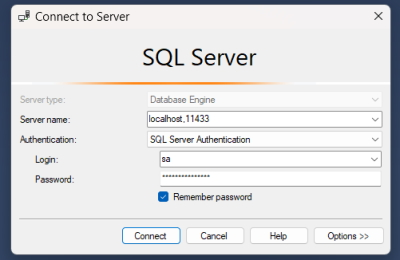
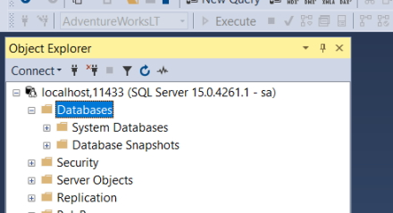
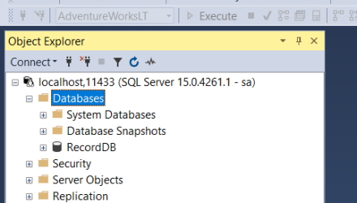
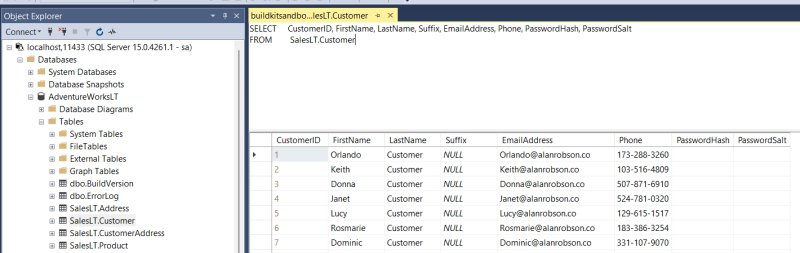

# Using Docker with SQL Server

Source code: ``Projects\docker-recorddb-mssql``.

## Install the SQL Server image

```powershell
docker run -e "ACCEPT_EULA=Y" -e "MSSQL_SA_PASSWORD=Pwd12345!" -p 11433:1433 -d mcr.microsoft.com/mssql/server:2019-latest
```

**Note:** every time you run this image you have to add the EULA statement or it doesn't work.

This installs the latest version of the image that we can use.

### Building the image

```powershell
    docker build -t record-db .
```

### Running the image

```powershell
    docker run -p 11433:1433 -d record-db
```

We have to give the image a port value. SQL Server is installed on my system and uses the port number ``1433`` so we can't use that. In our case we will use port ``11433`` instead. ``11433`` is the port we use to connect and ``1433`` is the port inside the container.

Once this is up and running we can open up SQL Server Management Studio (SSMS) and use the following to log in.

**Server:** localhost, 11433
**Username:** sa
**Password:** Pwd12345!

**Note:** localhost uses a comma in this situation.



Once you have logged in you will see your SQL server.



**Note:** you can create a database but each time you shut the container you will lose your changes because the image is read-only.

## Adding a database into your image

We will make a new image from the original SQL Server image that contains a database. We can use this to test and send out a database to other users in our team for testing.

In my docker folder I have 3 files.

* dockerfile
* RecordDB_BU.BAK
* restore-backup.sql

### dockerfile

```dockerfile
FROM mcr.microsoft.com/mssql/server:2019-latest AS build
ENV MSSQL_PID=Developer
ENV ACCEPT_EULA=Y
ENV SA_PASSWORD=Pwd12345!

WORKDIR /tmp
COPY RecordDB_BU.BAK .
COPY restore-backup.sql .

RUN /opt/mssql/bin/sqlservr --accept-eula & sleep 30 \
    && /opt/mssql-tools/bin/sqlcmd -S localhost -U SA -P "Pwd12345!" -i /tmp/restore-backup.sql \
    && pkill sqlservr

FROM mcr.microsoft.com/mssql/server:2019-latest AS release

ENV ACCEPT_EULA=Y

COPY --from=build /var/opt/mssql/data /var/opt/mssql/data
```

**FROM** is the image we will be using.

We have to add some **ENV** variables to for the image including the ``sa`` password.

**WORKDIR** is the current working directory that stores the file we require.

**/opt/mssql/bin/sqlservr** is where you run SQL server in the Linux image. 

**Note:** SQL Server here is spelled **sqlservr** using 8 characters for Linux.

**/opt/mssql-tools/bin/** is where we run a SQL script (restore-backup.sql) that restores a database backup.

We are going to download the **build** image and run the script to install The RecordDB database in the **release** image.

### RecordDB_BU.BAK

This is the backup file that we will restore using the following script.

### restore-backup.sql

```sql
RESTORE DATABASE [RecordDB] FROM DISK = '/tmp/RecordDB_BU.BAK'
WITH FILE = 1,
MOVE 'RecordDB' TO '/var/opt/mssql/data/RecordDB.mdf',
MOVE 'RecordDB_log' TO '/var/opt/mssql/data/RecordDB.ldf',
NOUNLOAD, REPLACE, STATS = 5
GO
```

**Note:** every time you update this database you can delete the current release image and create a new image.

The database and log file are stored in the Linux image, in ``/var/opt/mssql/data/``.

### Build the new image

```powershell
    docker build -t record-db .
```

### Run the new image

```powershell
    docker run -p 11433:1433 -d record-db
```

Log in to your SQL Server connection again and this time you will see your database.



Now you have a totally new image and you don't have to accept the EULA or add a password.

This database is used for testing purposes and any changes will be saved only in the container (not the image).

In my case I connected the database to my RecordDB website and I could test the database in the Docker container.

## Sanitising data in your database

Just imagine that you are sending this image to other members of your team and it contains sensitive data like emails, phone numbers, password hashes, etc.

We can run a sanitising script in our dockerfile.

To show an example of this we will create an image of the AdventureWorksLT database.

### sanitise-backup.sql

```sql
RESTORE DATABASE [AdventureWorksLT] FROM DISK = '/tmp/AdventureWorksLT2019.bak'
WITH FILE = 1,
MOVE 'AdventureWorksLT2012_Data' TO '/var/opt/mssql/data/AdventureWorksLT.mdf',
MOVE 'AdventureWorksLT2012_log' TO '/var/opt/mssql/data/AdventureWorksLT.ldf',
NOUNLOAD, REPLACE, STATS = 5
GO
USE AdventureWorksLT;
GO
UPDATE SalesLT.Customer
    SET EmailAddress = FirstName + '@alanrobson.co',
    LastName = 'Customer',
    Phone = FORMAT(CAST(LEFT(CAST(ABS(CAST(CAST(NEWID() AS BINARY(10)) AS INT)) AS VARCHAR(MAX)) + '0000000000', 10) AS BIGINT), '###-###-####'),
    PasswordHash = '',
    PasswordSalt = '';
```

Note that we are still restoring our database the same as our previous example. We add the ``USE`` statement after the restore and the rest of the code is our ``UPDATE`` script to update the Customer table. 

### dockerfile

```dockerfile
FROM mcr.microsoft.com/mssql/server:2019-latest AS build
ENV MSSQL_PID=Developer
ENV ACCEPT_EULA=Y
ENV SA_PASSWORD=Pwd12345!

WORKDIR /tmp
COPY AdventureWorksLT2019.bak .
COPY sanitise-backup.sql .


RUN /opt/mssql/bin/sqlservr --accept-eula & sleep 10 \
    && /opt/mssql-tools/bin/sqlcmd -S localhost -U SA -P "Pwd12345!" -i /tmp/sanitise-backup.sql \
    && pkill sqlservr

FROM mcr.microsoft.com/mssql/server:2019-latest AS release

ENV ACCEPT_EULA=Y

COPY --from=build /var/opt/mssql/data /var/opt/mssql/data
```

I have created a new folder with these files and the ``AdventureWorksLT2019.bak`` database backup.

### Build the new image

**Note:**  before you run this make sure you don't have the RecordDB image running because the port numbers will conflict.

```powershell
    docker build -t adventureworks .
```

### Run the new image

```powershell
    docker run -p 11433:1433 -d adventureworks
```

In SQL Server open the Customer table. The following image shows the fields that have been sanitised.



### Removing unnamed images

You can remove unnamed images. These are temporary images and can be removed.

```powershell
    docker system prune -f
```

## Examining the container

You can enter the running container with the following Docker command.

```bash
    docker exec -it record-db-mssql-record-db-1 "bash"
```

Databases are stored in.

> /var/opt/mssql/data

I can run queries in the container with.

> /opt/mssql-tools/bin/sqlcmd -S localhost -U SA -P Pwd12345!

Query the database.

> 1> use recorddb;        
> 2> go       
> Changed database context to 'RecordDB'.
> 1> select name from Artist;
> 2> go

```bash
    name
    --------------------------------------------------
    William Ackerman
    The Allman Brothers Band
    Duane Allman
    Greg Allman
    Amazing Rhythm Aces
    Tori Amos
    ...
```

## Rebuilding a new Docker image

I occasionally update my database and need to rebuild the image. This can be done by running the Docker Compose file.

When I did this I found that the data in the running container was still showing the old version of the database.

I found that when you run Docker Compose it will rebuild the image but because the data is stored in the volume I built in the Compose file it will use that data and not the new version of the database.

To get around that you can delete the volume for the Compose file.

### How do I find the name of the volume I need to delete?

Run.

```bash
    docker ps
```

Will return the running containers and from here you can get the name of the container you are interested in.

> record-db-mssql-sc-recorddb-1

Now run this command list the contents of the container.

```bash
    dc inspect record-db-mssql-sc-recorddb-1
```

We are interested in the ``Mounts`` section.

```bash
    "Mounts": [
        {
            "Type": "volume",
            "Name": "record-db-mssql-sc_recorddb-data",
            "Source": "/var/lib/docker/volumes/record-db-mssql-sc_recorddb-data/_data",
            "Destination": "/var/opt/mssql",
            "Driver": "local",
            "Mode": "z",
            "RW": true,
            "Propagation": ""
        }
```

Our volume name is.

> record-db-mssql-sc_recorddb-data

### Deleting the Volume

```bash
    docker volume ls
```

Will list all volumes.

> DRIVER    VOLUME NAME
> local     docker-python-flask_db-data     
> local     kineteco_kineteco       
> local     mongodb-demo-app-master_mongo-data      
> local     mongodb-learning_mongo-data     
> local     mysql-recorddb_mysql-recorddb       
> local     postgres-docker_postgres_data       
> local     record-db-mssql-sc_recorddb-data        
> local     record-db-mssql_recorddb-data       
> local     record-db-mssql_sql_data        
> local     recorddb-test_sql_data      
> local     recordefcore-db-mssql-mc_msql_data      
> local     vehicleservice_mongo-data

The volume we need to delete is ``record-db-mssql-sc_recorddb-data``.

```bash
    docker volume rm record-db-mssql-sc_recorddb-data
```

Delete any containers that are used by our current image.

Delete the image (or images) that are used by our Docker Compose file.

Now we are at the stage where we can rebuild the image and we can do this by using.

```bash
    docker compose up
```

In our Compose file we are building the image if there isn't one. Once this is up and running you should see you new database.
