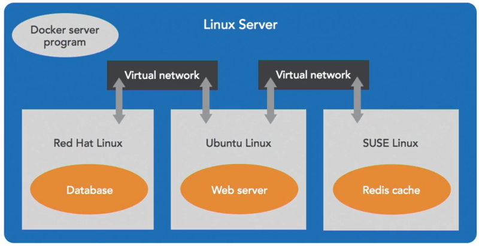
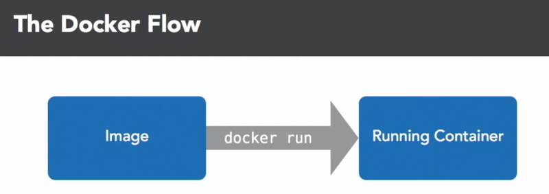
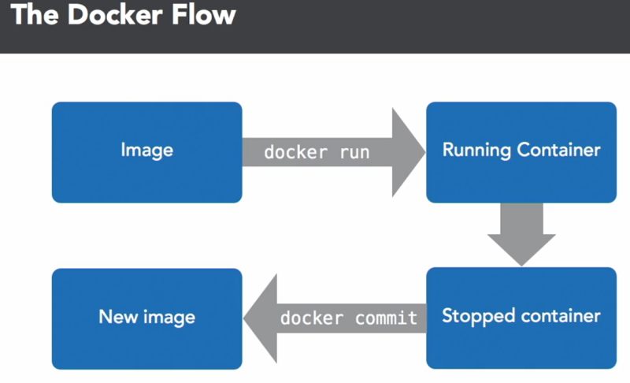

# Learning Docker 2021 Step by Step

## What is Docker

Docker carves up a Linux computer system into sealed containers that run your code. Each container is sealed from the world and runs by itself.

These containers are designed to be portable so that they can be shipped from one place to another. Docker does the work of getting these containers to and from your systems.

Docker also builds these containers for you and is a social platform designed to help you to find and share containers. Other people may have built containers that you can use to build on top of your won containers.

Docker isn't a virtual machine it is just an operating system that has been carved up into little pieces.

### What is a container

A container is a sealed unit of software. It has everything in it to run that piece of code including the operating system.

A container includes:

* All of the **code**.
* All of the **configs**.
* contains all of the **processes** within that container
* It has all of the **networking** to allow these containers to talk to other containers that they need to talk to and nothing else.
* It has all the **dependencies** that your system needs bundled up in that container and it also includes just enough of the operating system to run your code.

So Docker takes up all of the services to run a Linux server



The way Docker works is that it takes up all the services to run a Linux server including networking, storage, code, interprocess communication and it makes a copy of that in the Linux kernel for each container. Each container has its own little world that it can't see out of and other containers can't see in. You might have one container that runs a database in Red Hat Linux and another container that runs a web server in Ubuntu Linux and that web server might be talking to a Redis caching server container in Open Suse Ubuntu. It doesn't matter which Linux is running in each container and Docker is program that manages all of this.

Docker sets it up, monitors and tears it down when it is no longer needed.

Docker is a client program that you run in a terminal. It is also a server program that listens to messages from that command and manages a running Linux system.

Docker has a program that builds containers from code. It takes your code, along with its dependencies and bundles it up and seals it into a container and it is a service that distributes these containers across the internet and it makes it so you can find other peoples work and they can find your work. Docker is also a company that makes all of these containers.

## setting up Docker

Dockers primary job is to manage a Linux server and start and stop your containers as required.

Most of us don't work on laptops that run Linux all the time so many people use a virtual machine on their laptop to run the Linux server to run Docker on the server side. Docker helps run this virtual machine.

Docker has tools that make this nearly transparent.

To start with you have your computer and in your terminal it interacts with a program named Docker. This version of Docker is the client and that is connecting to a program named Docker that is a server controlling a Linux virtual machine. This virtual machine is being managed by Docker for Windows. Once you have it install you can click on the whale icon in your status bar. You usually don't have to interact with this program as it is fairly well automated.

## Installing Docker Desktop on Windows

**Note:** You should install Hyper-V and containers through Windows features before you install Docker Desktop.

Setup a Docker account. Once you have done this you can download Docker Desktop for Windows.

In the configuration option make sure you **don't** select - *Use Windows containers instead of Linux containers*. We will only want to use Linux containers.

**Note:** I have WSL for Linux on my PC so I didn't get this option. It is automatically using Linux containers.

Once installed pull up a terminal.

```bash
    docker info
```

Returns:

> Client:       
>  Context:    default      
>  Debug Mode: false        
>  Plugins:     
>   buildx: Docker Buildx (Docker Inc., v0.7.1)     
>   compose: Docker Compose (Docker Inc., v2.2.1)       
>   scan: Docker Scan (Docker Inc., v0.14.0)        
>       
> Server:       
>  Containers: 10       
>   Running: 0      
>   Paused: 0       
>   Stopped: 10     
>  Images: 28       
>  Server Version: 20.10.11     
>  Storage Driver: overlay2     
>   Backing Filesystem: extfs

This prints out information about Docker client and server. If you see a similar message you know your system is up and running.

Let's run a Docker container.

```bash
    docker run hello-world
```

This will run the ``hello-world`` container. If you don't have this container on your system Docker will download it from its repository. This won't take long because it is the smallest container you can run.

The Docker container will run and print out a massage and then tear itself down.

> Hello from Docker!

It also prints out some other information that describes the process that has just completed.

## The Docker flow - Images to containers

The Docker flow is a fundamental concept. It all begins with an image. An image is every file that is just enough of the operating system to allow you to do what you need to do. Traditionally you would install a whole operating system to do what you need to do. With Docker you pair it way down so you have a little container with just enough of the operating system to do what you need to do and you can have lots of these containers on your computer.

Let's look at our Docker images.

```bash
    docker images
```

Returns.

```bash
    REPOSITORY                    TAG       IMAGE ID       CREATED        SIZE        
    ubuntu                        latest    d13c942271d6   12 days ago    72.8MB      
    busybox                       latest    beae173ccac6   2 weeks ago    1.24MB      
    mysql                         8.0       3218b38490ce   4 weeks ago    516MB       
    alanrob17/nginx-website       latest    ae6252556552   5 weeks ago    148MB       
    ...
```

**Note:** The ``TAG`` is the version number of the image and ``IMAGE ID`` is the internal representation of the image in Docker.

Now that you have an image what do you do with it? You can run the Docker image and turn it into a running container with a process in it that is doing something. Let's look at running an image to make a container.

```bash
    docker run -it ubuntu:latest bash
```

where ``-it`` is run a terminal interface. We want to run the ``ubuntu:latest`` image and we want to run the ``bash`` shell in the container.

We end up with the bash shell running a root.

> PS C:\Temp\docker> docker run -it ubuntu:latest bash      
> root@35801cbffbc1:/# ls       
> bin  boot  dev  etc  home  lib  lib32  lib64  libx32  media  mnt ...      
> root@35801cbffbc1:/#

You see the bash prompt and you can run any linux command like ``ls``. When we run this we can see that we have a full command line version of Ubuntu linux with a large directory structure.

```bash
    cat /etc/lsb-release
```

Will show us the version of Ubuntu we are using.

> root@35801cbffbc1:/home/my-folder# cat /etc/lsb-release       
> DISTRIB_ID=Ubuntu     
> DISTRIB_RELEASE=20.04     
> DISTRIB_CODENAME=focal        
> DISTRIB_DESCRIPTION="Ubuntu 20.04.3 LTS"      
> root@35801cbffbc1:/home/my-folder#

To exit your container type ``exit`` or press ``CTRL-D``.

Run the Docker image again and this time pop open another terminal window at the same time.

In the new terminal window type.

```bash
    docker ps
```

This will show you a list of containers that are running at the moment.

```bash
    PS C:\Temp\docker> docker ps
    CONTAINER ID   IMAGE           COMMAND   CREATED         STATUS         PORTS     NAMES
    39e097b6bf4e   ubuntu:latest   "bash"    2 minutes ago   Up 2 minutes             nifty_lichterman
    PS C:\Temp\docker>
```

This time you can see the container that is running and because you didn't specify a name Docker will create one for you.

**Note:** Now that you are running the container you are seeing the ``container id`` not the ``image id``. These are two different Id's. You can also see the image that it came from, ``ubuntu:latest`` and see how long it has been running.

**Note:** If you are using a bash or Ubuntu terminal you can create a format string and add it to your ``.bashrc``. This will allow you to see vertical output.

In ~/.bashrc add.

```bash
    # vertical output for - docker ps --format=$FORMAT
    export FORMAT="ID\t{{.ID}}\nNAME\t{{.Names}}\nIMAGE\t{{.Image}}\nPORTS\t{{.Ports}}\nCOMMAND\t{{.Command}}\nCREATED\t{{.CreatedAt}}\nSTATUS\t{{.Status}}\n"
```

Now run.

```bash
    docker ps --format=$FORMAT
```

Returns.

> alanr@TIGER:/mnt/c/Temp/docker$ docker ps --format=$FORMAT        
> ID      39e097b6bf4e      
> NAME    nifty_lichterman      
> IMAGE   ubuntu:latest     
> PORTS     
> COMMAND "bash"        
> CREATED 2022-01-19 17:27:00 +1100 AEDT        
> STATUS  Up 23 minutes

This is an easier format to look at.

Now we have a running container. When we run a container we don't change the image. Any changes that we make will happen to the container and once you tear that container down you will lose the containers changes.

Now we are going to look at something that is different from running a virtual machine or a Linux server. Inside our container we can create a directory and a file.

> root@35801cbffbc1:/# mkdir home/my-folder     
> root@35801cbffbc1:/# cd /home/my-folder/      
> root@35801cbffbc1:/home/my-folder# touch list.txt     
> root@35801cbffbc1:/home/my-folder# ls     
> list.txt      
> root@35801cbffbc1:/home/my-folder#

**Note:** If you spin up another container you won't see the directory or file you created in the previous container. This because the image doesn't contain that directory or file.

If you exit the original container and start it up again the directory and file will have disappeared. They aren't part of the original image.




## The Docker flow - Containers to images

When you have a running container you can put files in it but it is only temporary and lasts until the container shuts down.

What if you want to save those files?

The next step in the Docker flow is the stopped container. When the process exits the container is still there so the file we created is still in the container. I can go back and find that container, it didn't get deleted. It is just that it is still in a stopped container.

I can look at the most recently stopped container with the ``ps`` command to show my containers.

```bash
    docker ps -a
```

``-a`` is show all stopped containers.

Shows all the containers that have run. At the top is the container we just closed.

```bash
PS C:\Temp\docker> docker ps -a
CONTAINER ID   IMAGE           COMMAND    CREATED           STATUS                      PORTS     NAMES
39e097b6bf4e   ubuntu:latest   "bash"     49 minutes ago    Exited (0) 7 seconds ago              nifty_lichterman
...
```

```bash
    docker ps -l
```

Will just show you the last container.

> alanr@TIGER:/mnt/c/Temp/docker$ docker ps -l --format=$FORMAT     
> ID      39e097b6bf4e      
> NAME    nifty_lichterman      
> IMAGE   ubuntu:latest     
> PORTS     
> COMMAND "bash"        
> CREATED 2022-01-19 17:27:00 +1100 AEDT        
> STATUS  Exited (0) 2 hours ago


At the moment we have started from an image ran a container and installed our software on it and then stopped the container.

The next step is the Docker ``commit`` command. That takes containers and makes a new image out of them. It doesn't delete the container but now we have a new image with the same content that was in the container.



So Docker run and Docker commit are complimentary to each other.

Now we can make a new image.

```bash
    docker commit 39e097b6bf4e
```

This returns the new image id.

> docker commit 39e097b6bf4e        
> sha256:97f6058c77a32bcafcc53631fb73121bcf6aba6a7e16fbc4cf20a1f32f7cb33b

We have made a new image with a large sha value which isn't convenient. Let's check the images.

```bash
    docker images
```

Returns.

``` 
    REPOSITORY                    TAG       IMAGE ID       CREATED         SIZE
    <none>                        <none>    97f6058c77a3   2 minutes ago   72.8MB
    ubuntu                        latest    d13c942271d6   12 days ago     72.8MB
    busybox                       latest    beae173ccac6   2 weeks ago     1.24MB
    mysql                         8.0       3218b38490ce   4 weeks ago     516MB
    ...
```

Notice that the image that we created is at the top. The first 12 characters of the sha value identifies that this the image we created.

Also note that there is no Repository or Tag.

We can give this image a tag name.

```bash
    docker tag 97f6058c77a32bcafcc53631fb73121bcf6aba6a7e16fbc4cf20a1f32f7cb33b my-ubuntu
```

Check the images again and you see.

```
    REPOSITORY                    TAG       IMAGE ID       CREATED         SIZE
    my-ubuntu                     latest    97f6058c77a3   9 minutes ago   72.8MB
    ubuntu                        latest    d13c942271d6   12 days ago     72.8MB
    ...
```

The repository is now named ``my-ubuntu``.

Run this image and see if your directory and file still exist.

```bash
    PS C:\Temp\docker> docker run -it my-ubuntu
    root@2718af6622db:/# ls
    bin  boot  dev  etc  home  lib  lib32  lib64  libx32  media  mnt ...
    root@2718af6622db:/# cd home
    root@2718af6622db:/home# ls
    alan
    root@2718af6622db:/home# cd alan
    root@2718af6622db:/home/alan# ls
    list.txt
```

You can do both of these steps in the one command with ``docker commit magical_blackwell my-newer-ubuntu``.

```bash
    PS C:\Temp\docker> docker ps -l
    CONTAINER ID   IMAGE       COMMAND   CREATED         STATUS                       PORTS     NAMES
    2718af6622db   my-ubuntu   "bash"    5 minutes ago   Exited (127) 3 minutes ago             magical_blackwell
    PS C:\Temp\docker> docker commit magical_blackwell my-newer-ubuntu
    sha256:3c3dd820dc428075845a2ee816611ddb608a77473a686d36b39a232210b530d4
    PS C:\Temp\docker> docker images
    REPOSITORY                    TAG       IMAGE ID       CREATED          SIZE
    my-newer-ubuntu               latest    3c3dd820dc42   13 seconds ago   72.8MB
    myubuntu                      latest    edd05ad27157   13 minutes ago   72.8MB
    ...
```

This is a simpler process. It is much easier than doing a commit and then doing a tag but just remember that underneath the hood that it is doing both commands.

