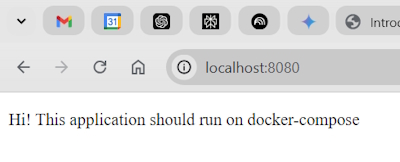

# Introduction to Docker

## Create an image

We want to create a web server to run some HTML code. A very small image can be created using ``httpd`` which will use a cutdown version of Alpine as the operating system. This will only be around 55 Mb in size.

Command to pull the image: **docker pull httpd:alpine** .

We won't use this but will use a build command to create the image.

We now create a folder to hold our web source code which consists of a simple HTML page named ``Index.html``.

Root folder ``IntroToDocker``, contains ``Dockerfile`` that is used to build our image.

Sub folder ``html``, contains an ``Index.html`` page.

### Dockerfile contains

```dockerfile
	FROM httpd:alpine
	COPY ./html/ /usr/local/apache2/htdocs/
```

Where **FROM** is the image to pull.
And we **COPY** our files from the ``./html/`` folder and load them into the Alpine image folder, ``/usr/local/apache2/htdocs/`` .

We are now able to user our **Dockerfile** to build an image.

```bash
docker build -t hello-docker:1.0.0 .
```

Do a search for the image you created.

```bash
	docker images h*
```

> REPOSITORY     TAG       IMAGE ID       CREATED         SIZE
> hello-docker   1.0.0     113447870bc6   3 minutes ago   55MB
> hellonode      latest    fc0b418d4dbd   11 months ago   113MB
> hello-world    latest    feb5d9fea6a5   13 months ago   13.3kB

We can do a history on the image using the **Image Id**.

```bash
	docker image history 113
```

Is the complete setup of our image and includes the byte size of each part.

```text
IMAGE          CREATED         CREATED BY                                      SIZE      COMMENT
113447870bc6   3 minutes ago   COPY ./html/ /usr/local/apache2/htdocs/ # bu…   349B      buildkit.dockerfile.v0
<missing>      4 weeks ago     /bin/sh -c #(nop)  CMD ["httpd-foreground"]     0B
<missing>      4 weeks ago     /bin/sh -c #(nop)  EXPOSE 80                    0B
<missing>      4 weeks ago     /bin/sh -c #(nop) COPY file:c432ff61c4993ecd…   138B
<missing>      4 weeks ago     /bin/sh -c #(nop)  STOPSIGNAL SIGWINCH          0B
<missing>      4 weeks ago     /bin/sh -c set -eux;   apk add --no-cache --…   12.7MB
<missing>      4 weeks ago     /bin/sh -c #(nop)  ENV HTTPD_PATCHES=           0B
<missing>      4 weeks ago     /bin/sh -c #(nop)  ENV HTTPD_SHA256=eb397fee…   0B
<missing>      4 weeks ago     /bin/sh -c #(nop)  ENV HTTPD_VERSION=2.4.54     0B
<missing>      4 weeks ago     /bin/sh -c set -eux;  apk add --no-cache   a…   36.7MB
<missing>      4 weeks ago     /bin/sh -c #(nop) WORKDIR /usr/local/apache2    0B
<missing>      4 weeks ago     /bin/sh -c mkdir -p "$HTTPD_PREFIX"  && chow…   0B
<missing>      4 weeks ago     /bin/sh -c #(nop)  ENV PATH=/usr/local/apach…   0B
<missing>      4 weeks ago     /bin/sh -c #(nop)  ENV HTTPD_PREFIX=/usr/loc…   0B
<missing>      4 weeks ago     /bin/sh -c set -x  && adduser -u 82 -D -S -G…   4.68kB
<missing>      2 months ago    /bin/sh -c #(nop)  CMD ["/bin/sh"]              0B
<missing>      2 months ago    /bin/sh -c #(nop) ADD file:2a949686d9886ac7c…   5.54MB
```

The bottom line is the operating system and this is the first thing that was created.

This line is the web server.

> /bin/sh -c set -eux;  apk add --no-cache   a…   36.7MB

This line (the latest line) is the code we copied into the image.

> COPY ./html/ /usr/local/apache2/htdocs/ # bu…   349B

## Create a container

We now create a container to run our image. The container is **read/write** so we can add content to it. If you stop running the container you will lose your changes because the container will be created from your existing image which is **read only**.

If you destroy the container it is gone but the image stays until you remove it.

```bash
	docker run --name first-container -p 8080:80 hello-docker:1.0.0
```

We call our container ``first-container``.

We need a port to run our web server, ``-p 8080:80`` .

*8080* is a port on our system and *80* is used to connect to the image, ``hello-docker:1.0.0`` .

We usually only need the first 3 characters of the **Container Id** to identify it.

If we look at our Powershell output we see the line.

> 172.17.0.1 - - [07/Nov/2022:07:13:04 +0000] "GET / HTTP/1.1" 200 185

This is returning the ``Index.html`` page (return status 200) and it returned 185 bytes.

This is the container we are running with its image name and tag.

```text
CONTAINER ID   IMAGE ...
a014eaedaf47   hello-docker:1.0.0 
```

We can stop the container from running by.

```bash
	docker stop a01
```

If we want to remove the container.

```bash
	docker rm a01
```

**Note:** if we want to delete the container after we are finished we could have done this.

```bash
	docker run --rm --name first-container -p 8080:80 hello-docker:1.0.0
```

Add a new file to our *html* folder named ``help.html``.

The original hello-docker:1.0.0 image won't have our changes because images never change so we will create a new image with our changes in it.

```bash
	docker build -t hello-docker:1.0.1 .
```

To check our images

```bash
	docker images hello-docker*
```
 
> REPOSITORY     TAG       IMAGE ID       CREATED              SIZE
> hello-docker   1.0.1     71a874cb898c   About a minute ago   55MB
> hello-docker   1.0.0     113447870bc6   About an hour ago    55MB

We increment the tag and we can run it with.

```bash
	docker run --name second-container -p 8080:80 hello-docker:1.0.1
```

We now have our new website running.

Note: we can't name two containers with the same name. This would cause an error.

We now have two images with both containing different code.

```bash
	docker images hello-docker*
```

> REPOSITORY     TAG       IMAGE ID       CREATED       SIZE
> hello-docker   1.0.1     71a874cb898c   2 hours ago   55MB
> hello-docker   1.0.0     113447870bc6   3 hours ago   55MB

Shows that I have two images. I know know that ``hello-docker:1.0.1`` has my full web source so I can delete ``hello-docker:1.0.0``.

```bash
	docker rmi 113
```

Where ``rmi`` removes an image.

## Benefits of Docker

You can build and tear down images and containers very quickly and easily.

Once you finish testing you can deploy your code and remove your images.

Docker saves you from having to install a lot of software on your system. You can create an image and use that.

A Docker image will never change so once you get your code working it will work forever on any system or cloud that runs Docker images.

### Remove all containers

```bash
	docker container prune
```

## More notes

Create an Nginx website in a container.

```bash
	docker run --rm -p 8080:80 --name nginx-compose nginx
```

This will show the standard Nginx web page. What if we want to add our own web page?

Create a project with a folder named ``static-site``. In this folder add an ``index.html`` page.

Now run this command. Note that this command will only run in Linux.

```bash
	docker run --rm -p 8080:80 --name nginx-compose -v $(pwd)/static-site:/usr/share/nginx/html nginx
```

When I run this on a Windows PC with **Powershell** I get an error. To get around this in **Powershell**.

```bash
	docker run --rm -p 8080:80 --name nginx-compose -v $PWD/static-site:/usr/share/nginx/html nginx
```

This returns.



I can also run this using **Curl**.

```bash
	curl localhost:8080/index.html
```

Returns.

```bash
	<!DOCTYPE html>
	<html>
	<head>
	<title>Hello World</title>
	</head>
	<body>
	<p>Hi! This application should run on docker-compose</p>
	</body>
	</html>
```

Now we have everything needed to migrate this application to Compose. We will create a Compose
file for the default NGINX installation:

```bash
services:
  nginx:
    image: nginx
    ports:
      - 8080:80
```

When we run this it will show the default NGINX web page. To run our web page add this to the ``docker-compose.yml`` file.

```bash
services:
  nginx:
    image: nginx
    ports:
      - 8080:80
    volumes:
      - ./static-site:/usr/share/nginx/html
```

Adding the volumes will allow us to run our own HTML content.

### Using your Docker image on Docker Compose

By using Compose, we have achieved running the default NGINX image and changing the default HTML page that was displayed. 

NGINX outputs logfiles in a text format and we want to change this output to JSON data.

We have a running container so we can shell into the container to check the configuration file.

```bash
	docker exec -it docker-nginx-nginx-1 cat /etc/nginx/nginx.conf
```

We use cat to print out the configuration file.

This is the section that contains the logfile configuration.

> log_format  main  '$remote_addr - $remote_user [$time_local] "$request" '		
>                       '$status $body_bytes_sent "$http_referer" '		
>                       '"$http_user_agent" "$http_x_forwarded_for"';

We will copy the file locally to apply the JSON configuration change:

```bash
	docker cp docker-nginx-nginx-1:/etc/nginx/nginx.conf nginx.conf
```

This copies the configuration file to our project folder.

We will change the ``log_format`` to.

> log_format main escape=json '{"remote_addr":"$remote_addr","remote_user":"$remote_user","time":"[$time_local]","request":"$request",\'"status":"$status","body_bytes_sent":"$body_bytes_sent","http_referer":"$http_referer",\'"http_user_agent":"$http_user_agent","http_x_forwarded_for":"$http_x_forwarded_for"}';

**Note:** I had problems with the ``log_format`` command. I changed it to one long line of text.

Now stop the current container and change the image to allow for the new configuration file.

We need to create a ``Dockerfile``.

```bash
FROM nginx

COPY nginx.conf /etc/nginx/nginx.conf
```

Create a new image.

```bash
	docker build -t custom-nginx:0.1 .
```

Now we need to change the ``docker-compose.yml`` file to allow for the custom image that we created.

```bash
services:
  nginx:
    image: custom-nginx:0.1
    ports:
      - 8080:80
    volumes:
      - ./static-site:/usr/share/nginx/html
```

### Logfiles

There are two logfiles created by the NGINX container.

> /var/log/nginx/access.log		
> 		
> /var/log/nginx/error.log

I exec'd into this container and couldn't see any logs. To see the logfiles you can run the following command to continuously stream the logfiles.

```bash
	docker logs -f 0463
```

``-f`` streams the logfiles continuously for the container ``0463``.

To be able to see content from the logfiles I requested a dummy webpage and this created an error.

Most of the output was in a JSON format so I know that my configuration changes are working.

## Hosting on a Registry

At present the images we are using are locked to our local computer. What can we do to use the image from anywhere in the world. We would host it in a centralised image registry.

There are a number of image registries but we will be using [Docker Hub](https://hub.docker.com).

My image registry on Docker hub is ``alanrob17``. [My Docker Hub](https://hub.docker.com/search?q=alanrob17).

I have a number of images hosted on Docker hub and the format for these images is.

> alanrob17/record-app-nginx:ctr2024

Where:

* ``alanrob17`` is my Docker Hub ID.
* ``record-app-nginx`` is my Image.
* ctr2024 is my Tag.

**Note:** I don't have a Tag on this image so my real registry image is.

> alanrob17/record-app-nginx

**Note:** in future I need to give each image a Tag.

To push to Docker hub.

```bash
	docker image push alanrob17/record-app-nginx
```

So at this stage we have created our application. We have created a Dockerfile that tells Docker how to package our application up and pushed it to Docker Hub.

It can be found at (Record app)[https://hub.docker.com/r/alanrob17/record-app-nginx].

## Running our container

Imagine that an image is a stopped container and a container is a running image.

First things is to delete your current image.

Now run.

```bash
    docker container run -d --rm --name alan-web -p 8000:80 alanrob17/record-app-nginx
```

Returns.

> 97f9a0651629f2636fd7df59fc50ca09a0f2ac078794c5a26fbb81396f89e2ee

As we are running detached it just leaves us with the ID of the container.

Breakdown of the command.

* ``-d`` means run detached.
* ``-rm`` means remove the container once it is finished running.
* ``--name alan-web`` means **alan-web** is the name of the container
* ``-p 8000:80`` means ports. **8000** is the port on the Docker host and **80** is the port that the container is listening on.
* ``alanrob17/record-app-nginx`` is the image that we want to use. In this case it doesn't exist on our local machine so it will try to find and pull it from Docker hub.

**Note:** the full name of the image is ``docker.io/alanrob17/record-app-nginx``. If you don't add ``docker.io`` it assumes that you are pulling the image form Docker Hub.

You can list the containers running with.

```bash
    docker container ps
```

Or.

```bash
    docker container ls
```

## Managing a Containerised App

We currently have a containerised application running and we can run this to stop it.

```bash
    docker container stop alan-web
```

Or.

```bash
    docker container stop 97f9a
```

Where **97f9a** is the start of the container Id.

We can then remove the container if we need to with.

```bash
    docker container rm alan-web
```

**Note:** we didn't have to do this because we used the switch ``--rm`` which automatically remove the container once we finished running it.

## Running containers interactively

In the previous example we used the switch ``-d`` to detach the container from our terminal. We don't have to do this and we can watch the container running with the ``-it`` switch which means interactively or in a terminal.

Run another container  from an image.

```bash
    docker container run -it --name alpine-test alpine sh
```

This time it leaves you with a command prompt.

You are inside the shell and can run commands.

You can exit the shell with the command **exit**.

If you want to leave the shell (container) running you can exit gracefully with **Ctrl-P-Q**.

If you do a ``docker ps`` you will notice that the container is still running.

If you want to stop and remove the container in one command.

```bash
	docker rm alpine-test -f
```
